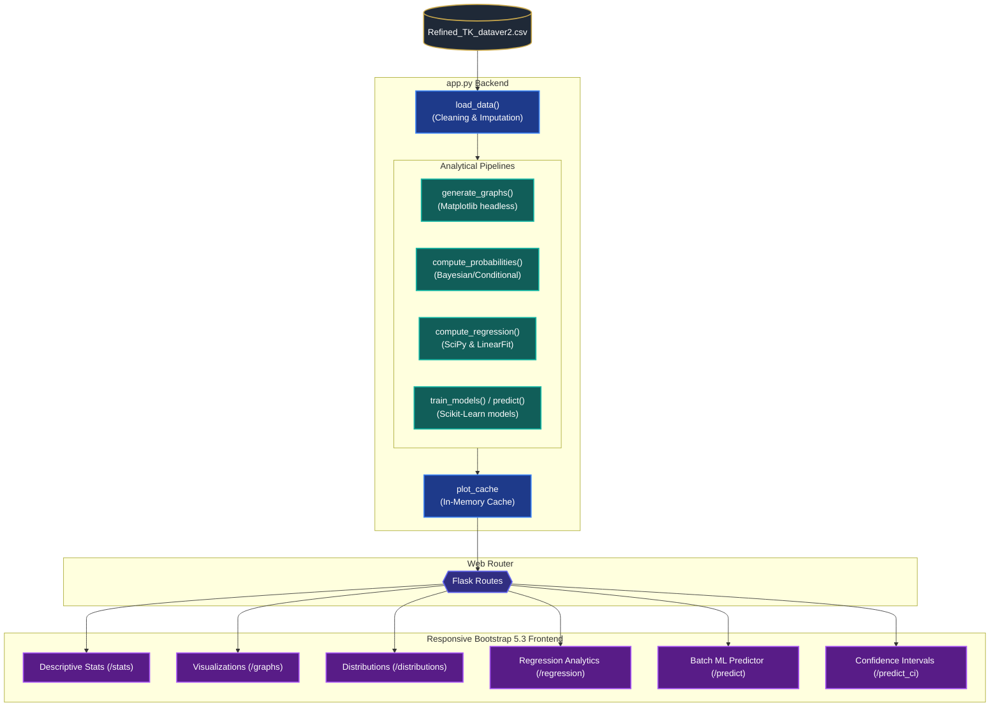

# 🏛️ Toshakhana Dataset Analysis Dashboard

[](https://www.python.org/)
[](https://flask.palletsprojects.com/)
[](https://pandas.pydata.org/)
[](https://scikit-learn.org/)
[](https://getbootstrap.com/)
[](https://opensource.org/licenses/MIT)

An interactive, premium-designed data analytics and predictive machine learning dashboard exploring Pakistan's Toshakhana gift registry dataset (covering years **2002–2022**). The platform visualizes gift distributions, performs statistical modeling, plots linear regressions, and implements multi-model machine learning workflows to predict gift retention behaviors, values, and costs.

---

## 🗺️ System Architecture

The diagram below illustrates the end-to-end data flow, processing pipelines, and rendering workflow within the application:



---

## 🌟 Premium Features

### 📊 1. Advanced Visualization Studio (`/graphs`)
Renders **9 high-performance data visualizations** directly onto custom Bootstrap layouts:
*   **Dual-Panel Histograms**: A split-screen Matplotlib grid plotting compressed global ranges next to the 0–90th percentile to highlight the extreme right skew.
*   **Item & Affiliation Distribution**: Sorted bar plots tracking incoming gift profiles.
*   **Time-Series Tracking**: An interactive timeline tracing historical valuations.
*   **Era Analysis**: Proportional pie chart distributions profiling major political tenures (e.g., PTI vs. PMLN era split).
*   **Feature Heatmaps**:
    *   *Correlation Heatmap*: Pearson coefficients showing relationship strengths (e.g., strong pairing of $r = 0.79$ between Assessed Value and Retention Cost).
    *   *Log-Scale Covariance Heatmap*: Standardizes visualization of variance magnitudes spanning over 12 orders of magnitude using a $log_{10}$ transformation.

### 🎲 2. Probability Distribution Engine (`/distributions`)
Computes conditional and posterior probability matrices based on historical trends:
*   **Retention Probabilities**: Calculates base retention rates for all gifts.
*   **Conditional Risk Tables**: Maps probabilities of gift rejection by recipient affiliations and item categories, showing which segments are statistically least likely to pay retention fees.

### 📈 3. Linear Regression Suite (`/regression`)
Provides a complete statistical overview of the relationship between gift valuations and retention costs:
*   Generates a linear regression scatter plot and trendline.
*   Extracts mathematical coordinates: **Slope**, **Intercept**, and **$R^2$ Accuracy Coefficient**.

### 🤖 4. Multi-Model ML Pipeline (`/predict` & `/predict_ci`)
Employs scikit-learn models to estimate and classify gift attributes:
*   **Cost Predictor**: Fits a `LinearRegression` model to predict payment requirements.
*   **Retention Likelihood**: Trains a `LogisticRegression` classifier on categorical inputs (label-encoded) to estimate the probability of retention.
*   **Value Tier Classifier**: Implements a `RandomForestClassifier` to map gifts into *Budget*, *Standard*, *Premium*, or *Luxury* groups.
*   **Confidence & Margin of Error (`/predict_ci`)**: Computes custom point predictions with a mathematically rigorous **95% Prediction Interval** (calculating degrees of freedom, standard error of prediction, and critical t-values).

---

## 🛠️ Technology Stack & Specs

| Technology | Role | Purpose |
| :--- | :--- | :--- |
| **Python 3.8+** | Runtime | Core programming language |
| **Flask** | Backend Framework | Route management, template compilation, and request lifecycle |
| **Pandas** | Data Wrangling | Clean CSV inputs, format floats, and group data frames |
| **NumPy** | Vector Math | Fast array logic, log conversions, and data partitioning |
| **SciPy (stats)**| Statistical Modeling | Computes cumulative distribution functions and Prediction Intervals |
| **Scikit-Learn** | Machine Learning | Trains linear models, classifiers, and encodes categorical strings |
| **Matplotlib** | Visualizations | Generates plots using headless `Agg` backend with base64 buffers |
| **Bootstrap 5.3** | UI Shell | Grid system, dark theme presets, and component styling |

---

## 📂 Project Directory Structure

```text
├── app.py                      # Main entrypoint; controls Flask routes and ML pipelines
├── README.md                   # Project documentation, architecture, and guides
├── static/
│   ├── Refined_TK_dataver2.csv  # The cleaned Toshakhana dataset
│   ├── homeimg.jpeg            # Styled background image for the dashboard landing page
│   └── style.css               # Core design tokens, gradients, and custom responsive layouts
└── templates/
    ├── home.html               # Main landing page featuring glassmorphic buttons
    ├── stats.html              # Summarized descriptive statistics tables
    ├── graphs.html             # Multi-chart visual presentation grid
    ├── graph_detail.html       # Individual analysis page for selected graphs
    ├── distributions.html      # Renders calculated probability distributions
    ├── regression.html         # Interactive regression plotting and metric page
    ├── predict.html            # Batch predictive rows with value classifiers
    └── predict_ci.html         # Interactive portal for custom prediction intervals
```

---

## 🚀 Installation & Running Locally

Follow these quick commands to spin up the dashboard on your system:

### 1. Set Up Environment & Install Dependencies
Open your terminal and install the required Python libraries:
```bash
pip install flask pandas matplotlib scikit-learn numpy scipy
```

### 2. Launch the Application
Run the Flask server from the directory containing `app.py`:
```bash
python app.py
```

### 3. Access Dashboard
Open your favorite browser and navigate to:
```url
http://127.0.0.1:5000/
```

---

## 🔍 Data Clean & Pipeline Specifications

<details>
<summary><b>Click to expand Data Cleaning details</b></summary>

The application implements several validation rules upon running `load_data()`:
1.  **Affiliation Standardization**: Maps variation strings like `'Gen Mus'`, `'Gen Mush'`, and `'Gen. Musharrafarraf'` to a single clean label `'Gen. Musharraf'`.
2.  **Item Normalization**: Standardizes descriptions (e.g., `'One Carpet'` $\rightarrow$ `'One carpet'`).
3.  **Numerical Coercion**: Extracts float formats for `Assessed Value` and `Retention Cost`, dropping incomplete records where both parameters are missing.
4.  **Unknown Imputation**: Fills empty categorical cells with `'Unknown'` to prevent encoder failures during ML inference.

</details>

<details>
<summary><b>Click to expand Machine Learning Pipeline details</b></summary>

Upon entering the `/predict` route, the backend trains models on the fly:
*   **Linear Regression Model**: Features = `[['Assessed Value']]`, Target = `'Retention Cost'`.
*   **Logistic Regression Model**: Features = `[['Assessed Value', 'Aff_enc', 'Cat_enc']]`, Target = `'retained_bin'`.
*   **Random Forest Classifier**: Features = `[['Aff_enc', 'Cat_enc']]`, Target = `'value_tier'` (defined via custom bins: Budget $\le$ 5K, Standard $\le$ 40K, Premium $\le$ 500K, Luxury > 500K).
*   **Performance Optimization**: Model inferences and graph generation buffers are stored in an in-memory cache (`plot_cache`) to prevent redundant CPU workloads on navigation.

</details>
